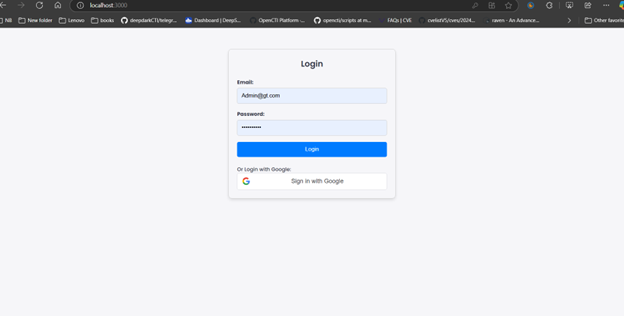
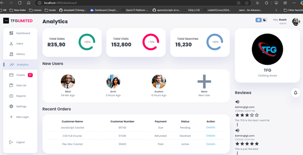
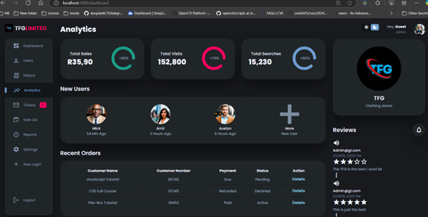
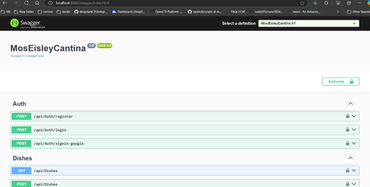
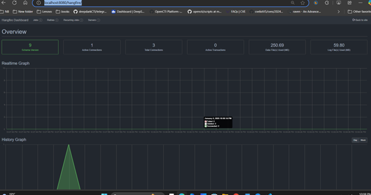
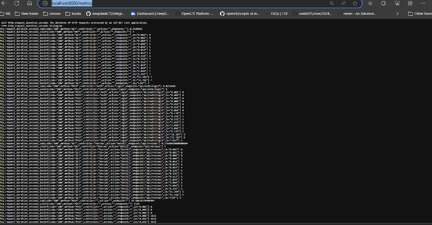
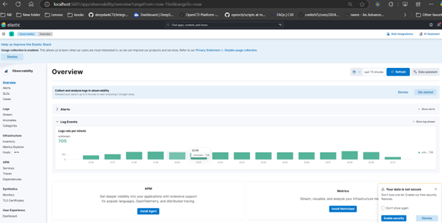

# Mos Eisley React Project

A project showcasing the Mos Eisley Cantina system.

---

## Features

- Feature 1: User Authentication and sso google aauth
- Feature 2: Real-time review Updates
- Feature 3: ElasticSearch and serilog
- Feature 3: Ratelimiting and IP blocking for suspicious users
---

## Installation

### Backend
1. Navigate to the backend directory:
   ```bash
   cd MosEisleyCantina
   ```
2. Install dependencies:
   ```bash
   dotnet restore
   ```
3. Run the backend:
   ```bash
   dotnet run
   ```

### Frontend
1. Navigate to the frontend directory:
   ```bash
   cd mos-eisley-react
   ```
2. Install dependencies:
   ```bash
   npm install
   ```
3. Run the app:
   ```bash
   npm start
   ```

---

## Usage

1. Access the app at `http://localhost:3000`.
2. Use the navigation menu to explore features.

---

## Screenshots

### Login Page


### Dashboard


### Darkmode Feature


### Swagger Feature


### Hangfire Feature


### Prometheus Feature


### Kibana Feature


---

## Docker Setup

Use the `docker-compose.yml` file to run the full stack application.

1. Build and run the containers:
   ```bash
   docker-compose up --build
   ```
2. Access the app:
   - Frontend: `http://localhost:3000`
   - Backend: `http://localhost:8080`
   - Hangfire: `http://localhost:8080/hangfire/`
   - Prometheus: `http://localhost:8080/metrics`
   - Prometheus: 'http://localhost:9090/targets'
   - Elasticsearch/Kibana: `http://localhost:5601/`

---

## Contributing

1. Fork the repository.
2. Create a new branch:
   ```bash
   git checkout -b feature-branch
   ```
3. Commit changes:
   ```bash
   git commit -m "Add a new feature"
   ```
4. Push to the branch:
   ```bash
   git push origin feature-branch
   ```
5. Open a Pull Request.

---

---

## Contact

For questions, reach out to:

- **Email**: samsonshishaba@outlook.com

